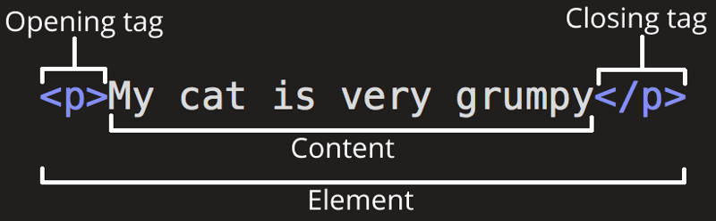
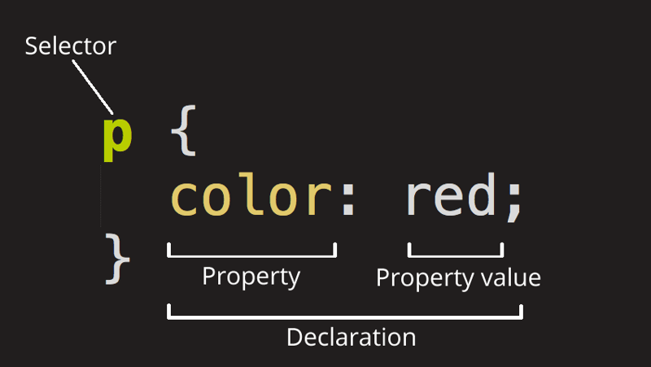

<aside class="box">This article is adapted from one that I originally published on <a href="https://dev.to/caesiumtea/bwc-bootcamp-recap-html-and-css-vocabulary-41e4">my dev.to</a> a few years ago, which I wrote for a friendly little online <a href="https://badwebsite.club/webdev-bootcamp-jan-2024.html">web dev bootcamp</a> that I was acting as a teaching assistant for.</aside>

One of the struggles when you're brand new to learning web development is just remembering all of the words that people are using! It can be really frustrating when a tutorial tells you to add an attribute and you're like "wait, what even is an attribute?" My aim here is to define all of those new terms that we'll encounter in the [freeCodeCamp Responsive Web Design](https://www.freecodecamp.org/learn/2022/responsive-web-design/) curriculum.

## key terms
- **HTML** is the most basic language of the web. *Every* web page uses HTML! It provides the **structure** and **content** of the page.
- **CSS** describes the **visual appearance**. This includes colors, fonts, sizes, and how things are laid out on the page.
- **Accessibility** refers to how usable your website is for different types of people, particularly people with disabilities. We all have a duty to make our websites as accessible as possible, because the web is for everyone!


## HTML

(Image from [MDN: HTML basics](https://developer.mozilla.org/en-US/docs/Learn/Getting_started_with_the_web/HTML_basics), by Mozilla Contributors, licensed under [CC-BY-SA 2.5](https://creativecommons.org/licenses/by-sa/2.5/))
    
- Each “thing” in an HTML document (in other words, each thing in a web page) is called an **element**. For example, this could be a picture, a link, or a chunk of text.
- Most elements start with an **opening tag** and end with a **closing tag**. However, there are some **self-closing** tags (also known as **void elements**), which don’t have a closing tag. *
    - How many self-closing tags can you name?
- A tag might have **attributes** to determine its properties. An element can have many attributes, or none!

```html
<p class="large-text"><em>Bad Website Club</em></p>
```

- This whole line is a **p element**.
- `<p class="large-text">` is the **opening tag**.
- `</p>` is the **closing tag**.
- `class="large-text"` is an **attribute**.
- `class` is the **attribute name** and `large-text` is the **attribute value**.
- The `em` element is a **child** of the `p` element, because it’s placed inside. `p` is the **parent** element. We also say that the `em` element is **nested** inside the `p` element, like a little baby bird sitting inside its parent’s nest!
- The **descendants** of an element are *everything* nested inside it: its child elements, but also its children's child elements, and its children's children's children, and so on. In the following example, `section` and `p` and `em` are all descendants of `body`, but only `section` is a direct child of `body`:
```html
<body>
  <section>
    <p class="large-text">
      <em>Bad Website Club</em>
    </p>
  </section>
</body>
```

<aside class="small-text box">Note: According to the <a href="https://html.spec.whatwg.org/multipage/syntax.html#start-tags:void-elements">HTML specification</a>, "self-closing tag" actually does not refer to void elements, and has a more specific technical meaning instead. However, you will still often see the term "self-closing tag" used to mean "opening tag which does not have a partner closing tag", including in the freeCodeCamp Responsive Web Design curriculum.</aside>

## CSS

(Image from [MDN: CSS basics](https://developer.mozilla.org/en-US/docs/Learn/Getting_started_with_the_web/CSS_basics), by Mozilla Contributors, licensed under [CC-BY-SA 2.5](https://creativecommons.org/licenses/by-sa/2.5/))

- CSS is grouped into **rules**.
- A rule starts with a **selector**. This part determines *which elements* the rule will apply to. 
- Each line inside the curly braces is called a **declaration**. This part says *how you want to change* those elements. This word doesn't come up super often though.
- The part before the colon (`:`) is the **property**.
- The part after the colon is the property's **value**.

```css
.large-text {
  font-size: 2em;
}
```
- This whole code block is one CSS **rule**.
- `.large-text` is the **selector**.
- `font-size: 2em;` is a **declaration**.
- `font-size` is the **property**.
- `2em` is the **value** of `font-size`.
- When a CSS rule applies to certain elements, we say that it's **targeting** those elements. This rule *targets the `large-text` class*.

---

Did I leave something out? Are there any other words you've heard while learning web development that you don't understand, or maybe ones that you mix up with each other or just keep forgetting? Feel free to mention them in a comment and we can sort it out together!

## acknowledgements

Cover art by [Kiri](https://ecasticx.com/)!

Thanks to [Nicholas Stimpson](https://dev.to/alohci) for clearing up the definition of self-closing tags.